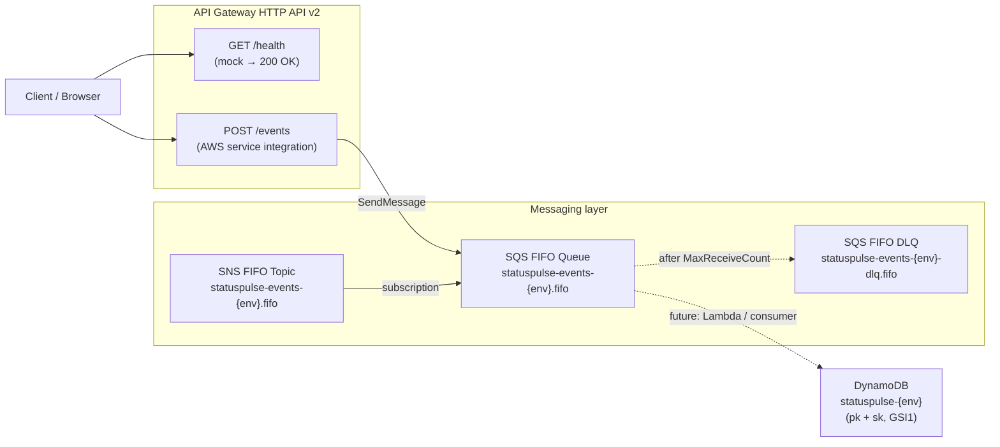

# StatusPulse Infrastructure

A **personal learning project** that mirrors the patterns of enterprise
CloudFormation + GitHub Actions OIDC deployments.  
No real data. No production workloads. A safe sandbox for practicing
infrastructure-as-code skills.

---

## Architecture



### Components

| Component | Resource | Notes |
|-----------|----------|-------|
| HTTP API | `AWS::ApiGatewayV2::Api` | Throttled; CORS configurable per env |
| GET /health | Mock integration | Returns `{"status":"ok"}` — no backend |
| POST /events | SQS-SendMessage integration | Uses a caller-supplied IAM role; no Lambda |
| SNS topic | `AWS::SNS::Topic` (FIFO) | Content-based deduplication enabled |
| SQS main queue | `AWS::SQS::Queue` (FIFO) | Subscribes to SNS; raw message delivery |
| SQS DLQ | `AWS::SQS::Queue` (FIFO) | 14-day retention for investigation |
| DynamoDB table | `AWS::DynamoDB::Table` | Single-table; GSI1; TTL; PITR |

---

## Environment / Branch Mapping

| Branch | Environment | Approvals |
|--------|-------------|-----------|
| `main` | **prod** | Required (GitHub environment protection) |
| `develop` | **qa** | Optional but recommended |
| any other | **dev** | None |

Push to `main` or `develop` automatically triggers the `deploy.yml` workflow
(if `cloudformation/` files changed).  
Any branch can be deployed manually via `workflow_dispatch`.

---

## Setup Checklist

### 1. AWS Sandbox Account
- [ ] Create or identify a dedicated AWS sandbox account (never use a shared account).
- [ ] Create an IAM role for CloudFormation deployments with the minimum permissions required.

### 2. GitHub OIDC Trust
- [ ] In the AWS Console → IAM → Identity Providers, add a new **OIDC provider**:
  - Provider URL: `https://token.actions.githubusercontent.com`
  - Audience: `sts.amazonaws.com`
- [ ] Create an IAM role (`statuspulse-gha-deploy`) with a trust policy that allows
  `sts:AssumeRoleWithWebIdentity` from your GitHub org/repo:
  ```json
  {
    "Effect": "Allow",
    "Principal": { "Federated": "arn:aws:iam::<ACCOUNT>:oidc-provider/token.actions.githubusercontent.com" },
    "Action": "sts:AssumeRoleWithWebIdentity",
    "Condition": {
      "StringLike": {
        "token.actions.githubusercontent.com:sub": "repo:<ORG>/<REPO>:*"
      },
      "StringEquals": {
        "token.actions.githubusercontent.com:aud": "sts.amazonaws.com"
      }
    }
  }
  ```
- [ ] Attach policies for CloudFormation, DynamoDB, SNS, SQS, API Gateway, IAM.

### 3. GitHub Environments
- [ ] In the repo settings → Environments, create `dev`, `qa`, `prod`.
- [ ] In each environment, add a variable `AWS_DEPLOY_ROLE_ARN` with the IAM role ARN.
- [ ] For `prod`, add required reviewers and branch protection (main only).
- [ ] (Optional) Add `AWS_VALIDATE_ROLE_ARN` (read-only) used by `validate.yml`.

### 4. Parameter Files
- [ ] Fill in `REPLACE_WITH_*` placeholders in `cloudformation/parameters/qa/` and
  `cloudformation/parameters/prod/` before deploying to those environments.

---

## Manual CLI Deployment

```bash
# Deploy a single stack (example: dev dynamodb)
aws cloudformation deploy \
  --stack-name statuspulse-dev-dynamodb \
  --template-file statuspulse-infra/cloudformation/templates/dynamodb.yml \
  --parameter-overrides file://statuspulse-infra/cloudformation/parameters/dev/dynamodb.json \
  --capabilities CAPABILITY_NAMED_IAM \
  --no-fail-on-empty-changeset \
  --region us-east-1

# Deploy all dev stacks in order using the PowerShell helper
pwsh statuspulse-infra/scripts/deploy.ps1 -Environment dev

# Validate templates locally
pwsh statuspulse-infra/scripts/validate.ps1
```

---

## Repository Layout

```
statuspulse-infra/
├── .github/workflows/
│   ├── _deploy-stack.yml    # Reusable: deploy one stack
│   ├── deploy.yml           # Orchestrator: all stacks in order
│   ├── destroy.yml          # Teardown with safety gates
│   └── validate.yml         # PR linting (cfn-lint + cfn-nag)
├── cloudformation/
│   ├── templates/           # One .yml per AWS service
│   └── parameters/          # Per-environment JSON overrides
│       ├── dev/
│       ├── qa/
│       └── prod/
├── docs/
│   ├── architecture.md
│   ├── deployment.md
│   └── decisions/
│       └── 0001-cloudformation-and-oidc.md
└── scripts/
    ├── validate.ps1          # Local cfn-lint / cfn-nag runner
    └── deploy.ps1            # Local aws cloudformation deploy helper
```
