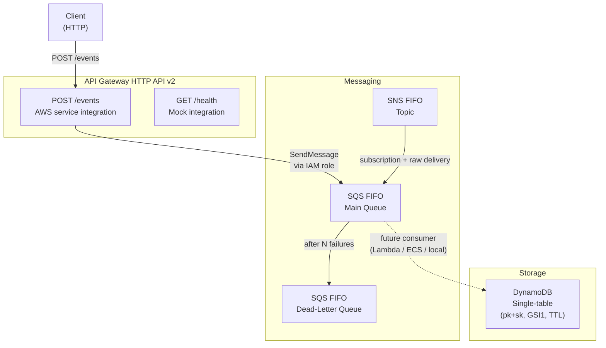

# Architecture — StatusPulse Infrastructure

## Overview

StatusPulse Infrastructure is a learning-grade event-ingestion skeleton that
demonstrates how to wire API Gateway → SQS → SNS → DynamoDB using only
managed AWS services and CloudFormation — no application code, no Lambda,
no containers.

---

## Component Diagram

---

## Component Details

### API Gateway HTTP API v2

- **Protocol**: HTTP (not REST — lower latency, lower cost, simpler routing).
- **GET /health**: Mock integration — API Gateway itself returns `{"status":"ok"}`
  with no backend call.  Useful for ALB / Route 53 health checks.
- **POST /events**: Direct SQS `SendMessage` integration using an IAM role
  (`ApiGatewayRoleArn`).  The request body becomes the SQS message body.
  Producers must supply `x-message-group-id` header (required by FIFO queues).
- **Throttling**: Burst + rate limits are per-environment parameters.
- **CORS**: Allow-origins is a parameter so dev can use `*` and prod can lock
  down to specific domains.

### SNS FIFO Topic

- Content-based deduplication — removes the need for producers to set
  `MessageDeduplicationId`.
- Optional KMS encryption (qa/prod).
- Optional initial subscription for wiring up additional consumers at stack
  creation time (e.g., email alerts during testing).

### SQS FIFO Queues

- **Main queue**: subscribes to the SNS topic; raw delivery skips the SNS
  envelope so consumers receive the original event JSON.
- **DLQ**: 14-day retention; messages land here after `MaxReceiveCount`
  failed delivery attempts on the main queue.
- **Queue policy**: allows SNS service principal to `SendMessage`, scoped by
  `aws:SourceArn` to prevent confused-deputy attacks.

### DynamoDB Single-Table

- **Primary key**: `pk` (HASH) + `sk` (RANGE) — supports hierarchical access
  patterns via `pk = ENTITY#<id>` + `sk = METADATA` or `sk = EVENT#<ts>`.
- **GSI1**: `gsi1pk` + `gsi1sk` — enables secondary access patterns (e.g.,
  query by status, by date range).
- **TTL**: `ttl` attribute; DynamoDB deletes expired items automatically.
- **PITR**: enabled in qa/prod; disabled in dev to save cost.
- **Deletion protection**: on in qa/prod; off in dev for easy teardown.
- **Billing**: PAY_PER_REQUEST everywhere — no capacity planning for a learning
  project.

---

## Difference from Prior Learner POC

This iteration deliberately omits an ingest Lambda between API Gateway and
SQS.  The direct SQS integration:

- Removes cold-start latency.
- Eliminates a deploy artifact to manage.
- Keeps the infrastructure complexity low while practicing the CloudFormation
  patterns that matter (OIDC, parameterisation, cross-stack ARN passing).

A consumer Lambda (or ECS task) that reads from SQS and writes to DynamoDB
is the next natural evolution.

---

## Future Evolution Path

1. **Consumer Lambda** — reads from SQS, validates schema, writes to DynamoDB.
2. **EventBridge Pipe** — replace direct SQS subscription with a Pipe for
   filtering and enrichment before the queue.
3. **Observability** — CloudWatch dashboards, alarms on DLQ depth, X-Ray
   tracing on the API.
4. **Custom domain** — Route 53 + ACM certificate + API Gateway custom domain.
5. **Multi-region** — DynamoDB Global Tables + regional stacks for active-active.
